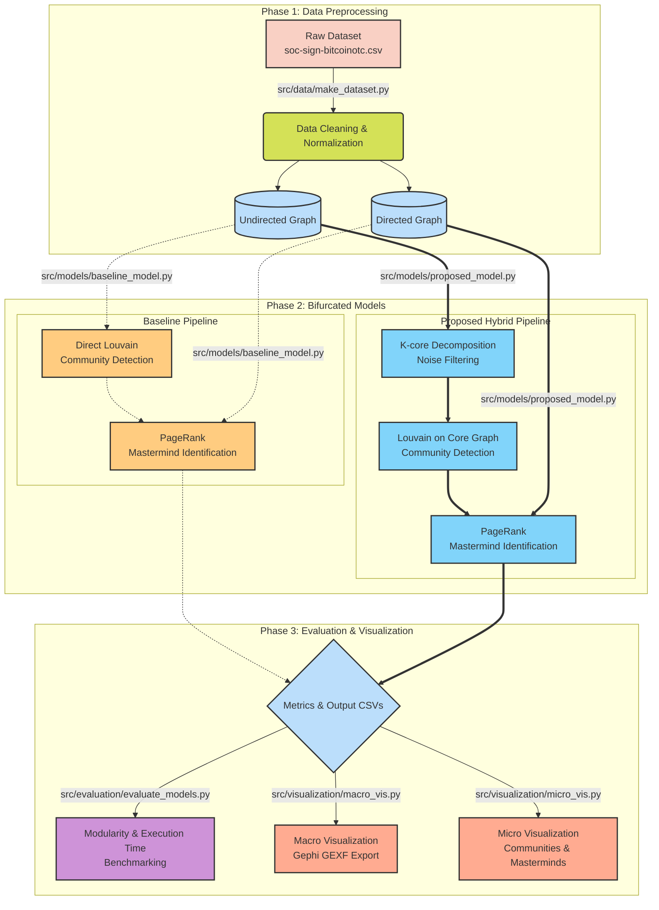

# System Architecture & Overall Dataflow Pipeline

Sơ đồ dưới đây mô tả luồng chạy dữ liệu của toàn bộ dự án, đối chiếu trực tiếp giữa Baseline Model và Proposed Model, kèm theo các file script tham chiếu.

